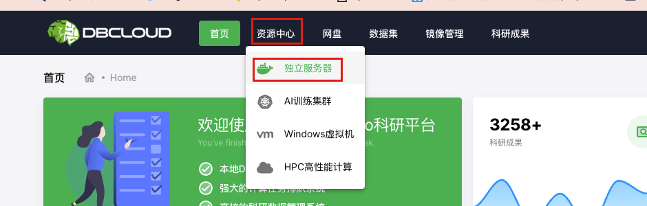
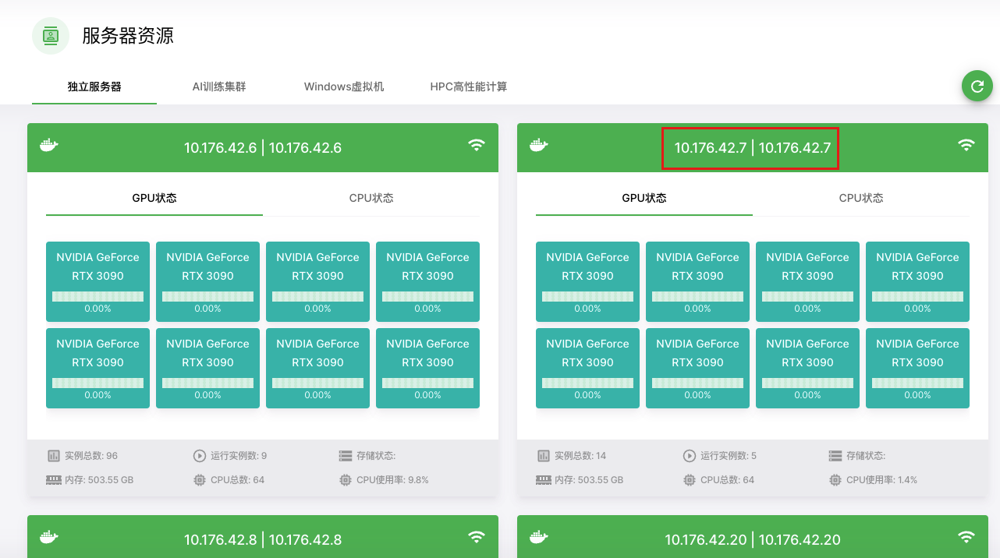
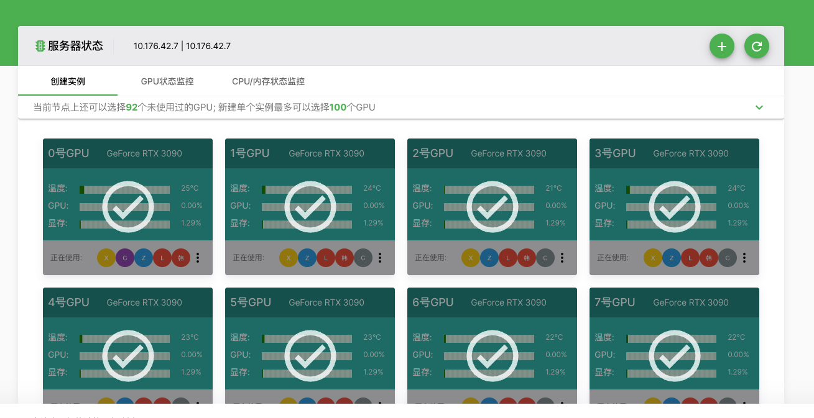
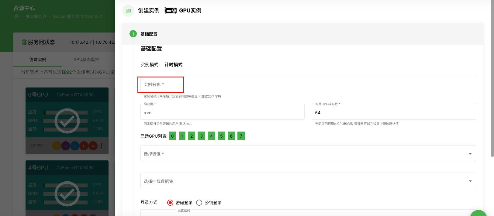
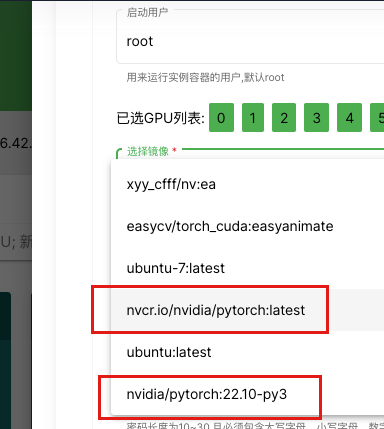
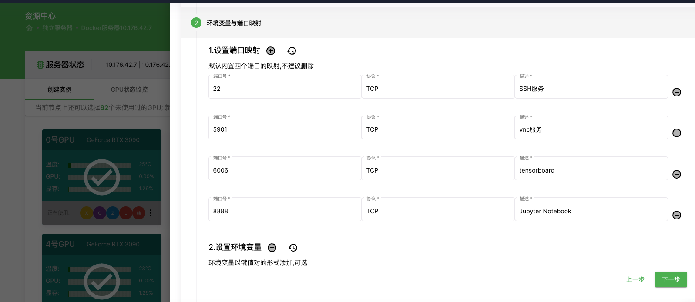
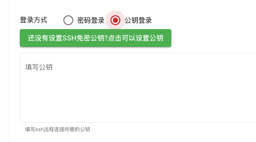
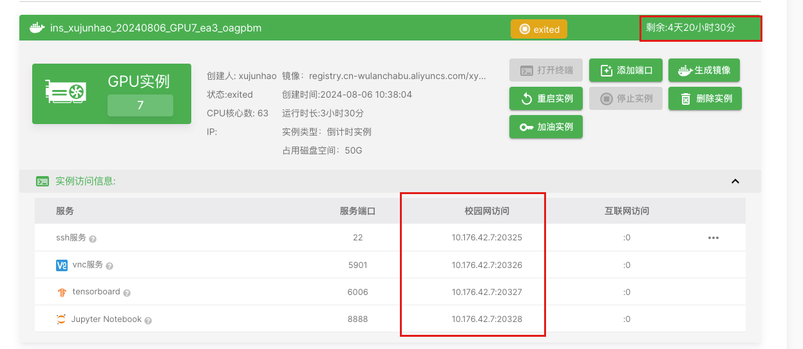
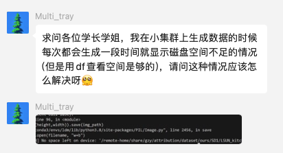
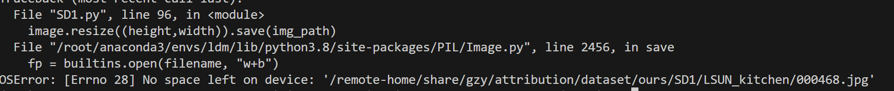

# 小集群使用说明

* 2024.12.18 更新`No Space Left`的情况说明
* 2024.09.30 更新SSH失败的checklist

by xyy 2024.09.03

- [小集群使用说明](#小集群使用说明)
  - [基本操作说明](#基本操作说明)
  - [存储结构说明](#存储结构说明)
  - [SSH登录](#ssh登录)
    - [为什么我要搁这用密钥?](#为什么我要搁这用密钥)
    - [如何用密钥登录?](#如何用密钥登录)
      - [给容器安装SSH服务端](#给容器安装ssh服务端)
    - [为什么我登录不上?](#为什么我登录不上)
  - [如何科学上网?](#如何科学上网)
    - [方法一 (如果xyy还没毕业)](#方法一-如果xyy还没毕业)
      - [1. 准备工作 (可跳过):](#1-准备工作-可跳过)
      - [2. 开始:](#2-开始)
      - [3. 取消代理:](#3-取消代理)
      - [4. 设置每个session都开启代理](#4-设置每个session都开启代理)
    - [方法二](#方法二)


## 基本操作说明

首先你需要有一个账号, 找到管理员给你开账号密码

小集群的前端WebUI地址: http://10.176.42.14:18888/

小集群的运作方式就是: 共享机器, 但通过运行属于自己的Docker容器以隔离工作环境(意味着其他人可能会跟你转撞到一张卡上)

1. 查看机器:

   

2. 选择机器, 我们这里有4台机器. 一般没人用的时候你都可以用. 但是如果你发现某台你要用的机器上有其他同学时, 注意使用的时候要和其他同学沟通协调一下.

   在这里假设选择`10.176.42.7`这台机器, 这里的`10.176.42.7`指的是这台机器的IP地址, 我们根据主机号, 一般口头称为7号机

3. 选择GPUs, **全部勾上**, 这样方便和其他同学沟通使用时, 确认自己该使用哪一张卡. 

   > 而且docker容器运行后, 无法修改选择的GPUs, 所以请全部勾上

   

4. 然后点加号➕, 创建实例. 这里实例名称你可以填你这个容器主要是用来干嘛的, 比如用来跑视频生成, 就可以叫`video_generation`

   

5. 然后用户名我们一般就默认root了, 除非你的容器有其他设置.

6. 镜像这里推荐使用英伟达的NGC的Pytorch镜像: https://catalog.ngc.nvidia.com/orgs/nvidia/containers/pytorch
   机器上一般已经带了几个我之前拉取的了

   具体NGC的镜像有啥, 请参看:https://docs.nvidia.com/deeplearning/frameworks/pytorch-release-notes/index.html

   >  请注意NGC的镜像可能没有自带SSH服务端, 你需要安装一下, 可以看后面SSH部分. 且使用NGC镜像注意重启容器后需要手动启动SSH.
   >
   > NGC的镜像, 一般默认带了一个miniconda或者是mambaforge(你可以理解就是你要用的conda)位置一般在`/opt/conda/bin`, 你可以通过命令`source /opt/conda/bin/activate root`激活conda
   >
   > CUDA位置在`/usr/local`下

   

7. 设置端口, 如果有需求, 或者以防万一, 这里可以多开几个需要映射的端口. (比如用来控制你的Clash的WebUI)

   如果没有其他需求, 直接默认即可.

   > 什么是端口映射?
   >
   > 端口映射是 Docker 中的一种机制，用来将容器内部的端口与宿主机（运行 Docker 的机器）上的端口连接起来。通过端口映射，外界可以通过宿主机的特定端口访问容器内部的服务或应用程序。

   

8. 注意公钥最好不要在这里写入, 不能保证这个前端能正确写入. 请你手动写入.

   

9. 一直下一步确定后, 可以看到已经运行起来的容器. 这里我们可以看到容器还有多久到期(到期后会被冻结, 而不会直接删除, **可以找管理员解冻, 重新充值时长**)
   在下面我们还可以看到对应映射出来的端口, 例如`22`端口被映射到`20325`

   如果我要用终端直接SSH这台机器的话(走`20325`端口, 账户用root登录, IP是`10.176.42.7`), 命令就是
   ```
   ssh -p 20325 root@10.176.42.7
   ```

   

## 存储结构说明

四台机器共享`/remote-home`目录

```
/remote-home/
|-- share # 这里面你的用户名的文件下放的东西其他用户看得到
`-- xujunhao # 这里面你放的东西其他用户看不到
```

然后每个容器的`/`目录, 存储的东西只有这台机器的这个容器可以访问. (对应了一个16T的机械硬盘)

## 最常见的No Space Left问题

关于存储空间不足, 在`/remote-home`目录有可能会遇到存储空间不足的问题. 

例如:






这个是平台的问题(工程师已经建议扩容了, 但是目前看管理的老师并没有计划扩容), 他们的存储集群应该是有一个盘用来存元数据(感觉和文件数量有更大关系), 经常会被写满, 就导致磁盘空间不足.
所以你用`df`命令看是正常的, 因为数据盘空间是够的. 

> 即使文件大小不是很大，文件数量仍然会有上限，这是因为文件系统需要维护每个文件的元数据，而元数据本身也需要占用存储空间和资源。以下是几个主要原因：
>
> **1. Inode 数量限制:**
>
> - 如前所述，每个文件和目录在 GPFS（以及大多数 Unix/Linux 文件系统）中都对应一个 **inode**。Inode 存储了文件的元数据信息，如文件大小、权限、时间戳、数据块位置等。
> - Inode 本身也需要占用存储空间。虽然每个 inode 的大小通常很小（例如几百字节），但是当文件数量非常庞大时，inode 占用的总空间也会变得可观。
> - 更重要的是，**文件系统在创建时会预先分配一定数量的 inode**。这个数量通常是固定的，一旦 inode 被用完，即使还有剩余的磁盘空间，也无法创建新的文件或目录，因为没有可用的 inode 来存储新文件的元数据。
>
> **2. Inode 表的存储和管理:**
>
> - 所有的 inode 信息通常存储在一个称为 **inode 表** 的数据结构中。
> - 文件系统需要维护和管理这个 inode 表，以便快速查找和访问文件的元数据。
> - 当文件数量非常大时，inode 表也会变得很大，这会增加文件系统管理 inode 表的开销，并可能影响文件访问性能。
>
> **3. 目录结构的限制:**
>
> - 目录本身也是一种特殊的文件，它也需要 inode 来存储元数据，并且目录中包含文件和子目录的列表。
> - 当一个目录中包含非常多的文件时，目录文件的大小也会变得很大，这会影响目录操作的性能，例如列出目录内容、查找文件等。
> - 一些文件系统对单个目录中可以包含的文件数量有限制。
>
> **4. 文件系统设计的权衡:**
>
> - 文件系统的设计需要在存储空间利用率、性能和可扩展性之间进行权衡。
> - 预先分配大量的 inode 可以支持更多的文件，但是会浪费存储空间，因为很多 inode 可能永远不会被使用。
> - 相反，分配较少的 inode 可以节省存储空间，但是会限制文件系统的最大文件数量。

这种情况下, 你可以把生成的数据路径挪到`/remote-home`之外, 例如你实例的`/home`目录下. 然后叫别人删一下那种存在`/remote-home`下个数很多的东西, 例如图片数据集

人话: `/remote-home`下的文件数量是有上限的, 而且是和其他组老师的学生一起shared的, 所以尽可能不要把图片数据集这种小而多的东西放在这. 同时为了避免你在训练保存权重时, 正好遇到文件数量满了, 保存失败, 你应该把权重存到非`/remote-home`子目录的路径, 例如`/my_ckpts`


## SSH登录

### 为什么我要搁这用密钥?

正常情况下, 我们应该优先使用密钥登录, 而非密码登录. (Vscode也鼓励你这样, 你用密码登录会发现一直要你输入)

> ### 密钥登录 SSH 的原理
>
> 1. **公钥和私钥对**：密钥登录依赖于一对密钥——一个公钥和一个私钥。公钥是公开的，可以分发给任何人，而私钥是保密的，只有你自己保管。
>
> 2. **配置密钥**：
>    - 你首先在本地生成一对密钥（公钥和私钥）。
>    - 然后，将公钥复制到你想要登录的远程服务器上，并配置在服务器的 `~/.ssh/authorized_keys` 文件中。
>    - 私钥保存在你本地的计算机上。
>
> 3. **登录过程**：
>    - 当你尝试使用 SSH 登录服务器时，服务器会检查你提供的公钥是否与它保存的公钥匹配。
>    - 如果匹配成功，服务器会发送一个用公钥加密的随机信息给你。
>    - 你的 SSH 客户端使用私钥解密这个信息，并将解密后的内容发送回服务器。
>    - 服务器验证解密后的信息是否正确，如果正确，就允许你登录。
>
> ### 为什么密钥登录更安全？
>
> - **避免密码暴力破解**：使用密钥登录时，不需要输入密码，因此攻击者无法通过猜测或暴力破解密码来获得访问权限。
> - **私钥不暴露**：私钥只保存在本地，即使公钥被公开，私钥的安全性仍然很高，攻击者无法轻易获得你的私钥。
> - **两步验证**：密钥对相当于一种基于公钥加密的两步验证机制，即使有人知道了服务器地址和用户名，没有私钥也无法登录。
>

### 如何用密钥登录?

先在本机上操作:

1. 基本所有平台, 都会将用户的公钥和私钥放在`~/.ssh/`下. 其中id_rsa 为私钥，id_rsa.pub 为公钥. 我们将要把公钥放服务器上.

2. 如果还没有密钥对, 开启终端就生成一个
   如果只有私钥, 就根据私钥生成一个公钥(需要先修改私钥权限, 保证只有自己能读写):

   ```
   chmod 600 ~/.ssh/id_rsa
   
   ssh-keygen -f ~/.ssh/id_rsa -y > ~/.ssh/id_rsa.pub
   ```

在服务器上, 

1. 找到自己用户的`~/.ssh/`. 如果没有`.ssh`文件夹就创建一个, 或直接用命令`ssh-keygen`新建一个密钥对.
2. 在`~/.ssh/`下找到或创建一个`authorized_keys`文件, 然后可以手动复制本地公钥内容放进去

***

如果你发现配置公钥后还是不行:

需要保证authorized_keys除了属主拥有读写(-rw)权限以外属组和其他用户是没有任何权限的

```
chmod 700 ~/.ssh
cd .ssh
chmod 600 ~/.ssh/authorized_keys
```

#### 给容器安装SSH服务端

1. Ubuntu(特别是自己扒拉下来的docker镜像)默认没有安装ssh的server，需要安装

   ```
   apt-get install openssh-server
   ```

2. 修改`/etc/ssh/sshd_config`文件

   ```
   vim /etc/ssh/sshd_config
   ```

3. 修改如下：允许root账户登录

   ```
   #PermitRootLogin prohibit-password
   PermitRootLogin yes
   ```

   > 在命令模式下
   >
   > `:wq`, 保存并退出 Vim 编辑器
   > `a`,  在当前光标所在位置之后插入随后输入的文本

4. 需要重启系统或者sshd服务, **(重启docker实例后可能也得弄一下)**

   ```
   /etc/init.d/ssh stop
   /etc/init.d/ssh start
   service ssh restart
   
   /etc/init.d/ssh stop && /etc/init.d/ssh start && service ssh restart
   ```

5. 安装ssh服务后，系统默认开启系统sshd，查看sshd状态如果不是默认启动，修改服务为enable

   ```
   systemctl enable ssh
   ```

如果你使用NGC镜像注意重启容器后需要手动启动SSH, 这里帮你写好到一行去了, 方便你复制执行, 可以谢谢我:

```
/etc/init.d/ssh start && service ssh restart && systemctl enable ssh
```

### 为什么我登录不上?

请按以下顺序检查:

1. 暂时先不要用vscode来远程登录, 先检查一下你是否在Windows的`cmd`或者是MacOS的`终端`中直接用SSH命令登录. (因为用vscode登录相当于会安装一个名为 VSCode Server 的组件, 可能是安装出现的问题, 有可能是权限的问题, 比如因为你不是root, 但你以为是)

2. 容器是否装了SSH

3. 容器的SSH是否开启了

4. 是否允许root登录, 看一下`/etc/ssh/sshd_config`里的设置

5. (如果你用密码) SSH是否开启密码登录, 看一下`/etc/ssh/sshd_config`里的设置

6. 检查你服务器上的.ssh相关权限:

   ```
   chmod 700 ~/.ssh
   chmod 600 ~/.ssh/authorized_keys
   ```

7. 检查本地.ssh相关文件权限:

   ```
   chmod 600 ~/.ssh/id_rsa
   ```

8. 检查公钥和私钥的指纹是否匹配:

   ```
   ssh-keygen -lf ~/.ssh/id_rsa.pub
   ssh-keygen -lf ~/.ssh/id_rsa
   
   指纹中的 SHA256 哈希值应一致。这表明你的私钥和公钥是配对的。
   ```

   

## 如何科学上网?

这里介绍两个方法:

> 大前提:
>
> * 实验室(或你自己的)服务器使用的是linux系统
> * 你的身份是老师/学生，本身就是root账户或已被分配了用户
> * 科研任务中需要访问外网资源，例如谷歌。
> * 在其他地方使用终端访问服务器，并且不希望由于自己开了梯子而影响其他使用用户

### 方法一 (如果xyy还没毕业)

用我配置好的服务, 烧的是我的💰, 请不要用来下特别大的东西:

#### 1. 准备工作 (可跳过):

1. 在校外网下(包括小集群, 大集群)

2. 检查和互联网的连通性: 

   ```
   ping baidu.com
   ```

   ping不通需要自行检查

3. 检查和我的服务器的连通性:

   ```
   ping 10.177.60.157
   ```

   如果发现ping不通, 检查你是否在校园网, 如果是的可以问一下我, 看看我的服务器是否在维护, 或是💰烧完了

#### 2. 开始:

1. 在命令行中设置环境变量

   ```
   export http_proxy=http://10.177.60.157:1089 && export https_proxy=http://10.177.60.157:1089 && export no_proxy="localhost, 127.0.0.1"
   ```

2. 注意: 我的服务是全局代理.

3. 检查是否可以用 (注意, 不要去`ping google.com`, ping是ICMP协议, 不会被代理)

   ```
   curl google.com
   ```

   如果返回

   ```
   <TITLE>301 Moved</TITLE></HEAD><BODY>
   <H1>301 Moved</H1>
   The document has moved
   <A HREF="http://www.google.com/">here</A>.
   </BODY></HTML>
   ```

   则okk, 如果啥也不返回, 则就是失败了, 可能是我的服务器在维护, 或是💰烧完了

#### 3. 取消代理:

在命令行取消已经设置的环境变量: 

```
unset http_proxy && unset https_proxy && unset no_proxy
```

#### 4. 设置每个session都开启代理

> 假设你使用的SHELL是bash

就是你打开任何一个terminal都可以自动代理:

把

```
export http_proxy=http://10.177.60.157:1089 && export https_proxy=http://10.177.60.157:1089 && export no_proxy="localhost, 127.0.0.1"
```

写入`~/.bashrc`

### 方法二

1. 先查看服务器的计算机架构:

   ```
   uname -m
   ```

2. 去clash仓库的release里找到对应的linux架构版本:~~https://github.com/Dreamacro/clash/releases~~

   * 2024.6.16更新, clash删库了, 用开源的clash meta: https://github.com/MetaCubeX/mihomo

3. 把下载下来的gz文件放到服务器上, 并解压:

   ```
   gunzip file.gz
   ```

4. 把自己win上想要用订阅改名成config.yaml (端口号也注意对应修改), 放到`~/.config/clash`, 或者是现场下载:

   ```
   wget "机场给你的订阅链接" -O config.yaml
   ```

5. ~~同时下载Country.mmdb(https://www.sub-speeder.com/client-download/Country.mmdb), 也放到`~/.config/clash`~~

   > ~~Country.mmdb为全球IP库，可以实现各个国家的IP信息解析和地理定位~~

6. 暴露接口(可以写入~./bashrc)

   ```
   export http_proxy=http://127.0.0.1:7895
   export https_proxy=http://127.0.0.1:7895
   export no_proxy="localhost, 127.0.0.1"
   ```

   ```
   export http_proxy=http://127.0.0.1:7895 && export https_proxy=http://127.0.0.1:7895 && export no_proxy="localhost, 127.0.0.1"
   ```

   >  如果有人在其他终端里也把7890给export了，那他也可以用你启动的clash访问外网了

   查看代理:

   ```
   env|grep -i proxy
   ```

7. 给clash执行权限, 并启动clash

   ```
   chmod +x clash-linux-amd64-v1.12.0
   setsid ./clash-linux-amd64-v1.12.0
   ```

   > setsid是为了方便启动clash后我能回到当前终端继续操作

8. 测试能不能上网:

   ```
   curl -Lv google.com
   ```

   > ping 使用的是 ICMP 协议，不支持代理。
   >
   > -L, --location      Follow redirects
   >
   > -v --verbose       Make the operation more talkative

9. 不用时, 关闭服务

   ```
   ps -ef | grep clash
   kill 进程号
   unset http_proxy && unset https_proxy && unset no_proxy
   ```

   > 注意第二个是系统进程, 不要kill了
   >
   > ```
   > (base) xujunhao@sdu-SYS-4029GP-TRTC-ZY001:/data/xujunhao/clash$ ps -ef | grep clash
   > xujunhao   31279       1  0 14:42 ?        00:00:02 ./clash-linux-amd64-v1.12.0
   > xujunhao  187277   28217  0 16:21 pts/12   00:00:00 grep --color=auto clash
   > ```


